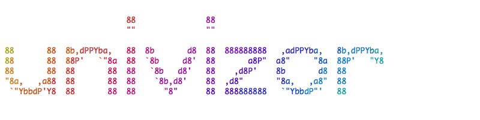

Generator of fancy animated ASCII GIF logos.

# Usage

```bash
make font=alligator2 text=l9o clean out.gif
```

# Why?

```
Why not? It uses all your CPU cores to generate fancy GIFs. ^.^
```

# Examples





# Dependencies

- `make`
- `bash`
- [GNU Parallel](https://www.gnu.org/software/parallel/)
- [artii](https://github.com/miketierney/artii)
- [lolcat](https://github.com/busyloop/lolcat)
- [ansi2html](https://pypi.python.org/pypi/ansi2html)
- [ImageMagick](http://www.imagemagick.org)
- [PhantomJS](http://phantomjs.org/)

# Author

- [Oto Brglez](https://github.com/otobrglez)
